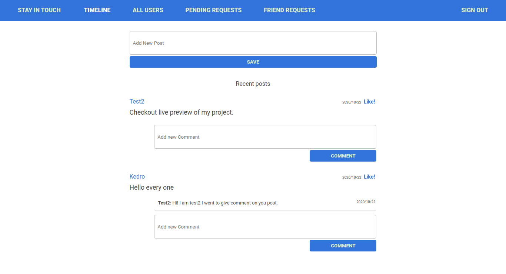

# Scaffold for social media app with Ruby on Rails

> This repo includes intial code for social media app with basic styling. Its purpose is to be a starting point for Microverse students.



## Built With

- Ruby v2.7.0
- Ruby on Rails v5.2.4

## Live Demo
[Open Live Demo](https://safe-headland-61563.herokuapp.com/)


## Getting Started

To get a local copy up and running follow these simple example steps.

### Prerequisites

Ruby: 2.6.3
Rails: 5.2.3
Postgres: >=9.5

## Setup configurations

To get this app ready to run, follow this steps:

* clone this repo

        pc:~$ git clone git@github.com:keddo/private-events.git

* install require gems

        pc:~$ bundle install
* in case you need to run

        pc:~$ yarn install --check-files
* Run database migration

        pc:~$ rails db:migrate

* Start the rails' server to test

        pc:~$ rails server or rails s

Setup database with:

```
   rails db:create
   rails db:migrate
```

### Usage

Start server with:

```
    rails server
```

Open `http://localhost:3000/` in your browser.

### Run tests

```
    rpsec spec
    rpsec --format documentation
```

### Deployment


## Author

👤 **Kedir Abdurahman**
- Github: [@keddo](https://github.com/keddo)
- Twitter: [@kedirman](https://twitter.com/kedirman)
- Linkedin: [Kedir Abdurahman](https://linkedin.com/in/kedirabdurahman/) 


👤 **Felipe Dacal Fragoso**

- Github: [@fdfragoso](https://github.com/fdfragoso)
- Twitter: [@fdfragoso](https://twitter.com/fdfragoso)
- Linkedin: [@fdfragoso](https://www.linkedin.com/in/fdfragoso/)

## Show your support

Give a ⭐️ if you like this project!

## Acknowledgments

- Project inspired by Microverse Program
- Project originally taken from the odin project